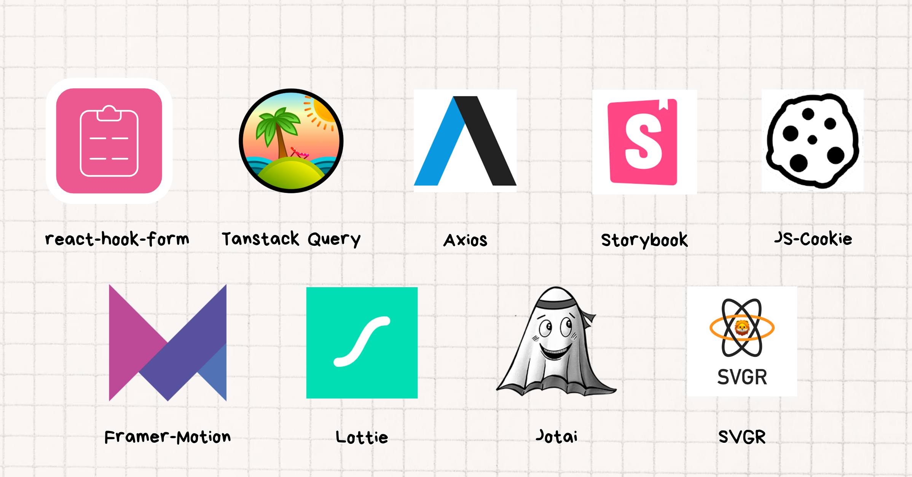
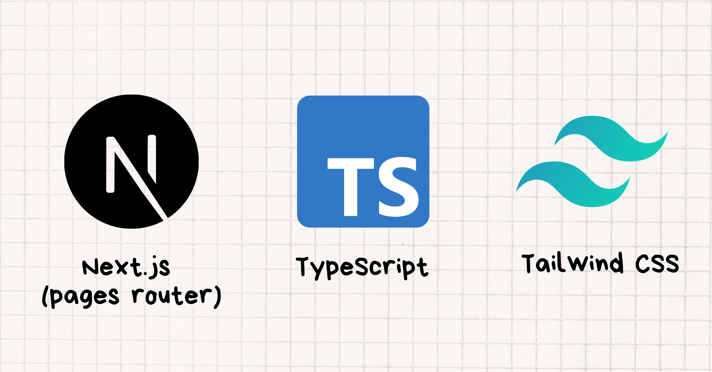

  

 

 

# 📝 프로젝트 개요

**프로젝트 명:** Global-Nomad

**프로젝트 설명:** 체험, 관광 등을 등록하고 예약하는 여행 웹 서비스

**프로젝트 기간:** 2024.07 ~ 2024.08

**배포 주소:** [https://global-nomad-team14.vercel.app/](https://global-nomad-team14.vercel.app/)

**발표 자료:** [파트4(14팀) 프로젝트 발표 자료](https://www.canva.com/design/DAGO62XBgsI/wum8z7gbSirs5wE94v_rQA/view?utm_content=DAGO62XBgsI&utm_campaign=designshare&utm_medium=link&utm_source=editor)

 

<!-- ### 화면 구성
|화면 명|
|:---:|
||
|화면에 대한 설명을 입력합니다.|

|화면 명|
|:---:|
||
|화면에 대한 설명을 입력합니다.| -->

 

## ⚙ 기술 스택

### Tools

 

## 💁‍♂️ 프로젝트 팀원

|                Frontend                 |                Frontend                |                 Frontend                  |                Frontend                |                     Frontend                     |
| :-------------------------------------: | :------------------------------------: | :---------------------------------------: | :------------------------------------: | :----------------------------------------------: |
|                |               |                  |               |                         |
| [고재성](https://github.com/devjaesung) | [이영훈](https://github.com/tkddbs587) | [소혜린](https://github.com/miraclee1226) | [이경원](https://github.com/gracelee5) | [오영택](https://github.com/Programmeryeongtaek) |
